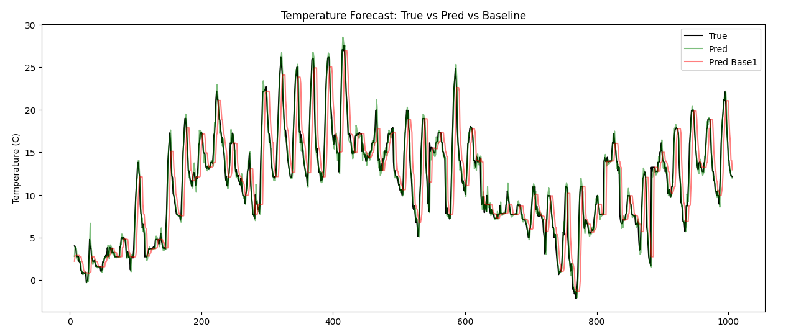

# ML_End2End_Forecasting_Weather

This project predicts today's temperature based on the temperature data from the past 7 days. It is an end-to-end machine learning project that showcases three major steps: data processing, model training, and inference. The project also includes a user-friendly dashboard built with Streamlit for easy interaction and temperature prediction.

## Project Overview

The goal of this project is to use historical temperature data to predict the temperature for the current day. The model is trained using temperature data from the last 7 days, enabling accurate predictions for today's temperature.

### Key Features
- **Data Processing**: The project handles the preprocessing of temperature data to prepare it for model training.
- **Model Training**: A machine learning model is trained on the historical temperature records from the past 7 days.
- **Inference & Prediction**: The trained model is used to predict today’s temperature based on the input data.
- **User Dashboard**: The Streamlit-based dashboard allows users to input temperature values from the last 7 days and get real-time predictions.

## Visualizations

1. **Line Chart**: Shows the comparison between the true data, predictions using a baseline model, and predictions from the trained ML model.
   

2. **Scatter Plot**: Shows the relationship between the true temperatures and the predicted temperatures.
   
